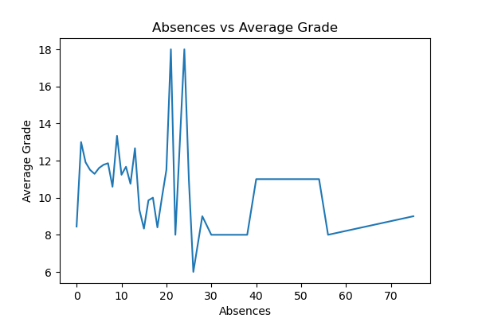
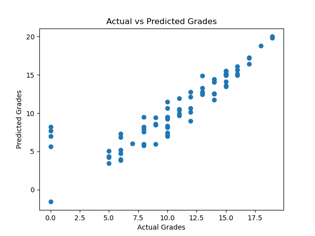
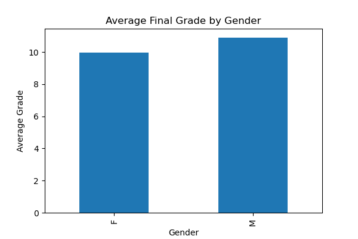
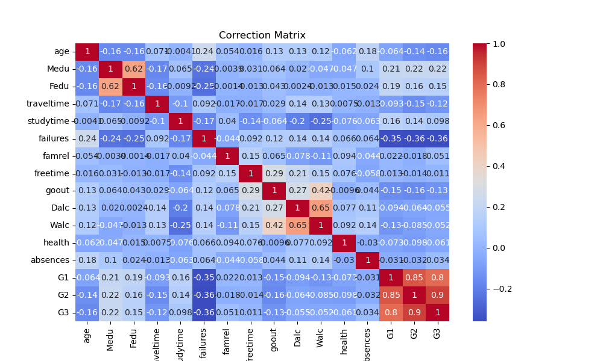
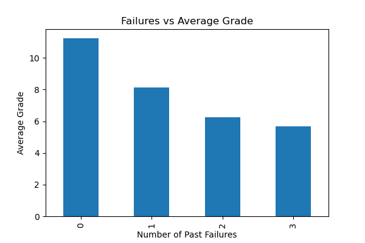
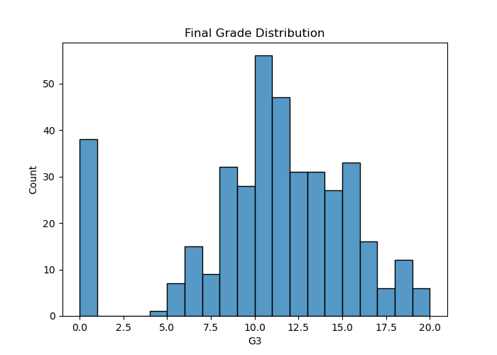
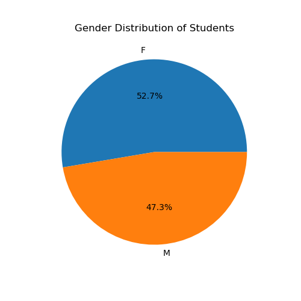
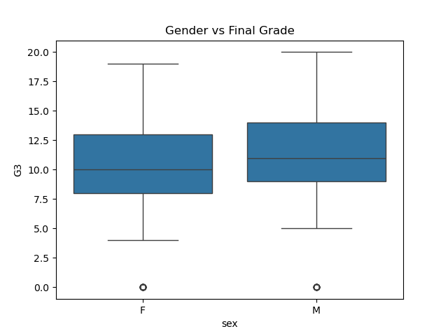
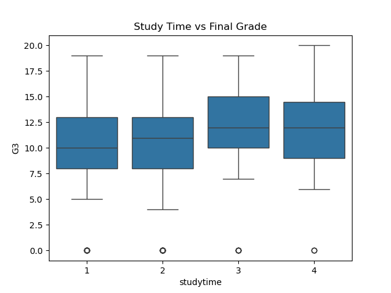

# Student Performance Analysis

## Project Overview

- This project analyzes a student performance dataset to understand the factors that affect academic results.
- The analysis includes data cleaning, exporatory data analysis (EDA), data visualization, and a machine learning model to predict final student grades.

## Tools & Library used

- Python
- Pandas
- NumPy
- Matplotlib
- Seaborn
- Scikit-learn
- Jupyter Notebook

## Dataset

- The dataset contains information about students such as:

-Gender
- Age
- Study time
- Family support
- Absences
- Previous grades (G1, G2)
- Final grade (G3)
- Other important data

## Data Analysis Steps

1. Data Collection
2. Data Cleaning
3. Exploratory Data Analysis (EDA)
4. Data Visualization 
5. Feature Selection
6. Machine Learning Model
7. Model Evaluation
8. Insights and Conclusion

## Visualization

- The project includes several visualizations:

- 
- 
- 
- 
- 
- 
- 
- 
- 

## Machine Learning Model

- A Linear Regression model was used to predict the final student grade(G3).

- Features used:
1. G1
2. G2
3. Study time
4. Absences

## Key Insights

- Students with more study time tend to get higher grades.
- higher absences negatively affect performance.
- Previous grades strongly influence final results.

## Author

Vidhi Sheladiya
B.Tech Computer Engineering (AI/ML)